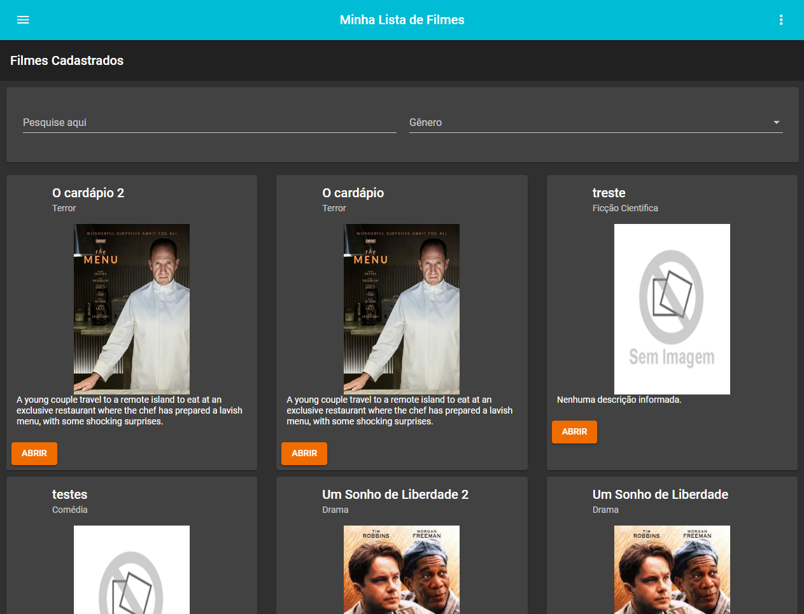
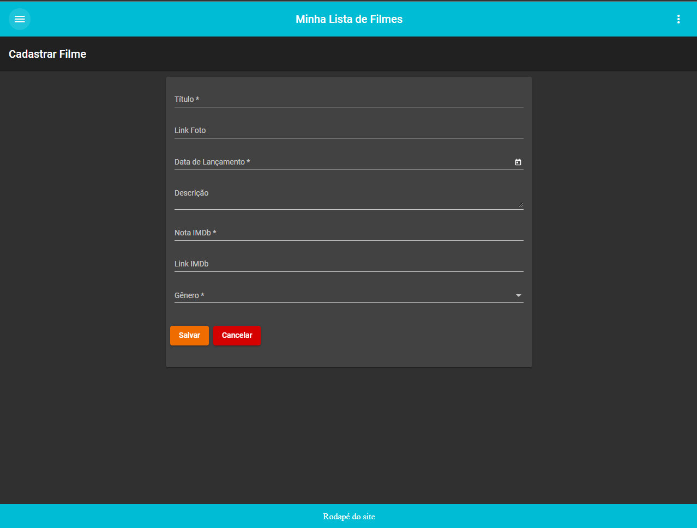
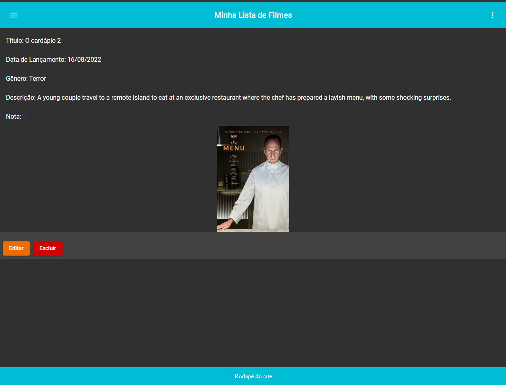

# crud-filmes


## Indice

- [crud-filmes](#crud-filmes)
  - [Indice](#indice)
  - [Sobre](#sobre)
  - [Funcionalidade da Aplicação](#funcionalidade-da-aplicação)
  - [Tecnologias utilizadas](#tecnologias-utilizadas)
  - [Como baixar o projeto](#como-baixar-o-projeto)
  - [Telas](#telas)
  - [Autor](#autor)
  
---

## Sobre

O Projeto **crud-filmes** foi desenvolvido para estudo para criar um CRUD e pesquisa por nome e gênero de uma aplicação de filmes em Angular 8. Utilizando algumas técnicas avançadas que o angular disponibiliza.

---

## Funcionalidade da Aplicação

As funcionalidades são:
- Criar Filme;
- Listar Filme;
- Editar Filme;
- Excluir Filme.
- Pesquisar Filme por nome e gênero

---
## Tecnologias utilizadas 

O projeto foi desenvolvido utilizando as seguintes tecnologias
- Angular 8
- TypeScript
- ngx-infinite-scroll
- CSS
- HTML

---

## Como baixar o projeto

```bash
# Clonar o repositório em sua máquina 
$ git clone https://github.com/francelinom/crud-filmes.git

# Entrar na pasta do projeto 
$ cd crud-filmes

# Instalar todas as dependências 
$ npm i

# Iniciar o projeto 
ng serve
# or
yarn dev

Abrir o projeto na porta: http://localhost:4200
```

---
## Telas






---
## Autor

Desenvolvido por **Francelino Marcílio da Silva** 
<h1>
  
</h1>
